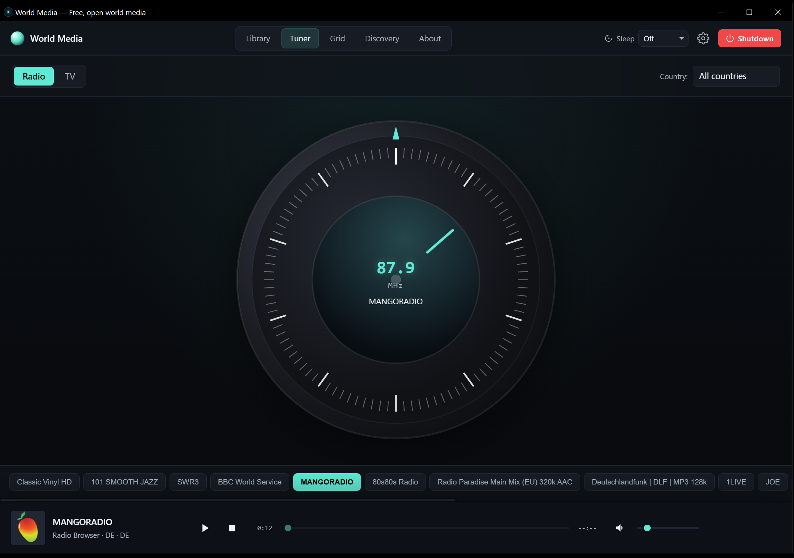
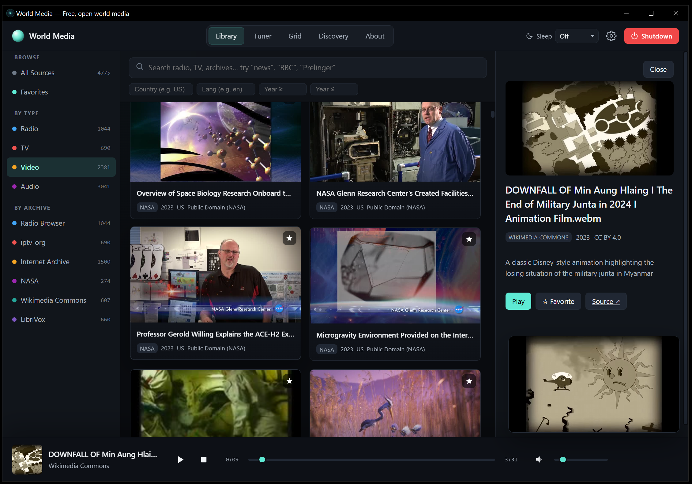

# World Media Windows


**World Media Windows is the lighter Windows-native build of World Media.** It
keeps the same open-media app experience: internet radio, live TV,
public-domain video, and public-domain audio from six public sources. It drops
the bundled Linux runtime and ships as a smaller Windows-only desktop app.


## Related Builds

Choose the build that matches what you need:

| Build | Repo | Best For | Tradeoff |
|---|---|---|---|
| **World Media Windows** | `aivrar/WorldMediaWindows` | Windows users who want the smallest, simplest `.exe` | Windows-only |
| **World Media** | [aivrar/world-media](https://github.com/aivrar/world-media) | The heavier cross-compatible/Linux-runtime build | Larger download and runtime footprint |

## Install

Download the release asset once a release exists:

```text
WorldMediaWindows.exe
```

Run it. The app starts a local server on `127.0.0.1`, opens a native WebView2
window, and stores runtime logs under:

```text
%LOCALAPPDATA%\WorldMediaWindows\
```

Users do not need Python, Node, Rust, Git, Docker, or WSL.

## What You Get

Five tabs across the top: **Library**, **Tuner**, **Grid**, **Discovery**, and
**About**.

**Library** - search and browse everything. Left sidebar groups results by type
and source: Radio Browser, iptv-org, Internet Archive, NASA, Wikimedia Commons,
and LibriVox.


**Tuner** - a radio-style dial for live radio and live TV. Drag the dial or use
arrow keys; each station gets a cosmetic frequency.



**Library detail panel** - click any item to see metadata, license, source, and
play it.



**Grid** - TV-guide-style tiles for live radio and live TV.

**Discovery** - random open media from the enabled sources.

## Playback

Video plays in a movable overlay with fullscreen support.


## Where The Content Comes From

Every item World Media surfaces comes from one of six public, freely accessible
archives. The app does not host content and does not require API keys.

| Source | What it provides | Home | Licensing |
|---|---|---|---|
| [Radio Browser](https://www.radio-browser.info) | Internet radio stations | `radio-browser.info` | Stations retain their own broadcast rights |
| [iptv-org](https://iptv-org.github.io) | Free-to-air IPTV channels | `iptv-org.github.io` | Stream operators retain their own rights |
| [Internet Archive](https://archive.org) | Films, recordings, books, and other media | `archive.org` | Per item, often public domain or Creative Commons |
| [NASA Image and Video Library](https://images.nasa.gov) | Mission photos, videos, and audio | `images.nasa.gov` | Public domain for U.S. government work |
| [Wikimedia Commons](https://commons.wikimedia.org) | Free-licensed media files | `commons.wikimedia.org` | CC-BY-SA or public domain per file |
| [LibriVox](https://librivox.org) | Public-domain audiobooks | `librivox.org` | Public domain |

## Privacy And Runtime Model

- **No accounts.** Nothing to sign up for.
- **No telemetry.** The app does not collect usage data.
- **No API keys.** All six sources use public anonymous endpoints.
- **Localhost only.** The bundled Python server binds to `127.0.0.1`.
- **Same-origin proxy with allowlist.** Some sources block browser requests for
  CORS reasons. The local proxy forwards only to the hard-coded public media
  hosts. Stream URLs are played directly and are not proxied.
- **No Linux child.** This build has no WSL distro, no rootfs image, no Docker
  image, and no setup script.

## Requirements

- Windows 10 or Windows 11
- Microsoft Edge WebView2 Runtime
- Internet access for upstream catalogs and streams

## Build From Source

```powershell
npm install
npm run build
python -m pip install -r requirements-build.txt
python .\build_windows.py --skip-frontend
```

The output is:

```text
dist\WorldMediaWindows.exe
```

See [docs/BUILD_WINDOWS.md](docs/BUILD_WINDOWS.md) for the full build and smoke
test flow.

## License

MIT. See [LICENSE](LICENSE). Content from the listed sources retains its
original license.
