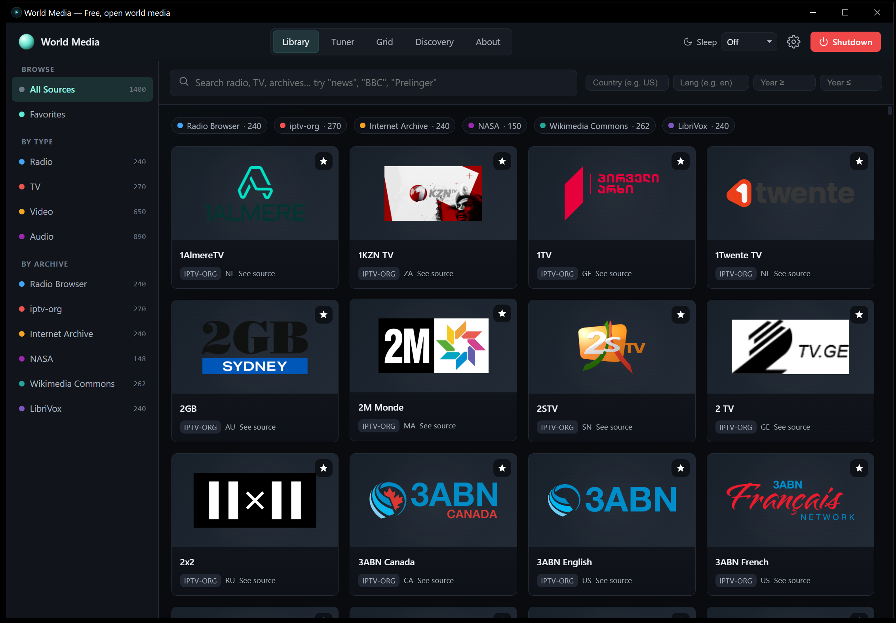

# World Media Windows


**World Media Windows** is the lighter Windows-native build of World Media: one
desktop app for free, open world media: internet radio, live TV, public-domain
video, and public-domain audio.

This repo drops the previous Linux-in-a-box runtime. The Windows release is a
single native `.exe` that bundles Python, the local HTTP/proxy server, the built
web UI, and a WebView2 desktop shell. Users do not need WSL, Docker, Node, Git,
Rust, or system Python.

## Screenshots



## What It Includes

- Unified Library search across Radio Browser, iptv-org, Internet Archive,
  NASA, Wikimedia Commons, and LibriVox.
- Tuner mode for live radio and TV.
- Grid mode for channel browsing.
- Discovery mode for random open-media playback.
- Local settings, favorites, and sleep timer.
- A strictly allowlisted localhost proxy for sources that block browser CORS.

## Quick Start

Download the release asset once a GitHub release exists:

```text
WorldMediaWindows.exe
```

Run it. The app starts a local server on `127.0.0.1`, opens a native WebView2
window, and stores logs under:

```text
%LOCALAPPDATA%\WorldMediaWindows\
```

## Requirements

For users:

- Windows 10/11
- Microsoft Edge WebView2 Runtime
- Internet connection for upstream media catalogs and streams
- No WSL, Docker, Git, Node, Rust, or Python installation required

For developers building the exe, see [docs/BUILD_WINDOWS.md](docs/BUILD_WINDOWS.md).

## Project Structure

```text
WorldMediaWindows/
|-- assets/
|-- docs/
|-- frontend/
|-- src/
|-- build_windows.py
|-- worldmedia_native.py
|-- worldmedia_server.py
|-- package.json
|-- requirements-build.txt
`-- README.md
```

## Privacy

- No accounts.
- No telemetry.
- No API keys.
- Local server binds to `127.0.0.1`.
- Proxy requests are limited to a hard-coded upstream host allowlist.
- Audio/video stream URLs are loaded directly by the player and are not proxied.

## License

MIT. See [LICENSE](LICENSE).
